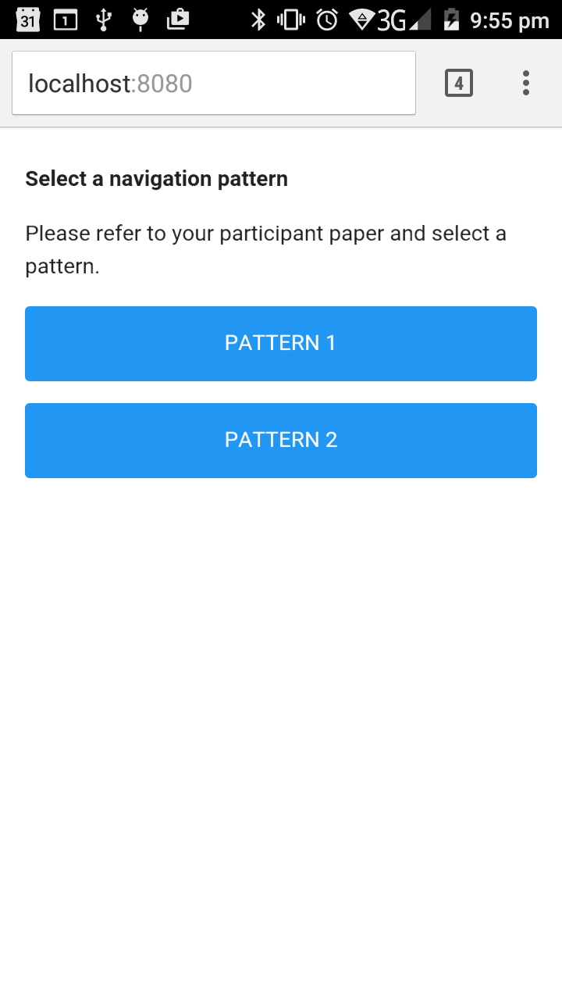
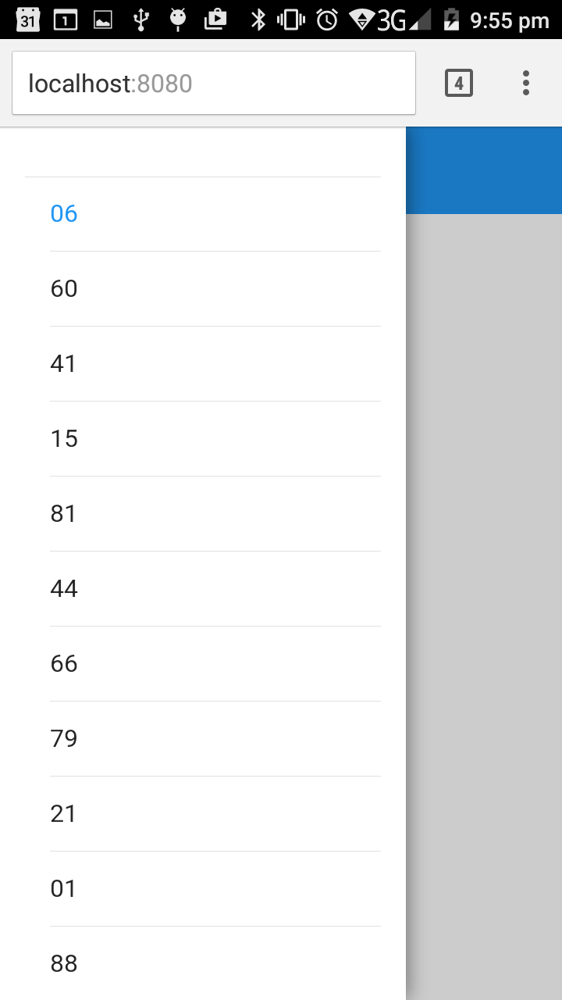
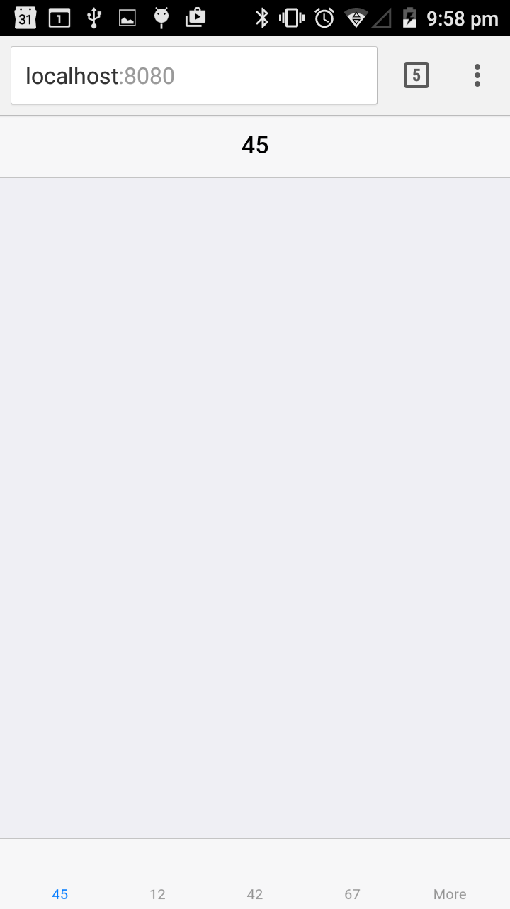

Purpose
========

This is a repo for a web application tool used in an HCI experiment
conducted by Pukar Bhattarai (http://pukar.co/) for his MSc master
project at University College London.

Overview
=========

The application consists of two parts:

1. Web application written in Javascript based on Framework7
   (http://framework7.io). The main application is encapsulated in experiment.js

2. Python web server script.
   This is written as extension to SimpleHTTPServer (for Python 2) and
   http.server (for Python 3) so that the web server can handle the
   POST request

Screen Shots
==========



How to Use
==========

Run the server in command line like so:

```bash
python HttpServer.py
```

for Python 3, or

```bash
python HttpServerPy2.py
```

for Python 2 (this is usually default for Mac OS).

Open a browser (intended to be used in Chrome) and go to
localhost:8080. The default host is hardcoded in the python script
(change it if necessary in the script).

The intention is to use the Mac machine as the server, and then use
a mobile device in the same WiFi network to access it.

The results will be automatically saved in the `results` folder, with
the name:

`p` + participant id + `.csv`, like this example:

	p12.csv

The meaning of the columns of the resultant csv file is documented in
`header_sample.csv` in `results` folder. 

Limitations etc.
===========

Intended to be used on Mac and a mobile device (iOS or Android) with
the latest Chrome browser (as of August/September 2016).

Not to be used in Internet Explorer (IE).

I believe I used some Javascript statements in `experiment.js` that
are not compatible with IE.


